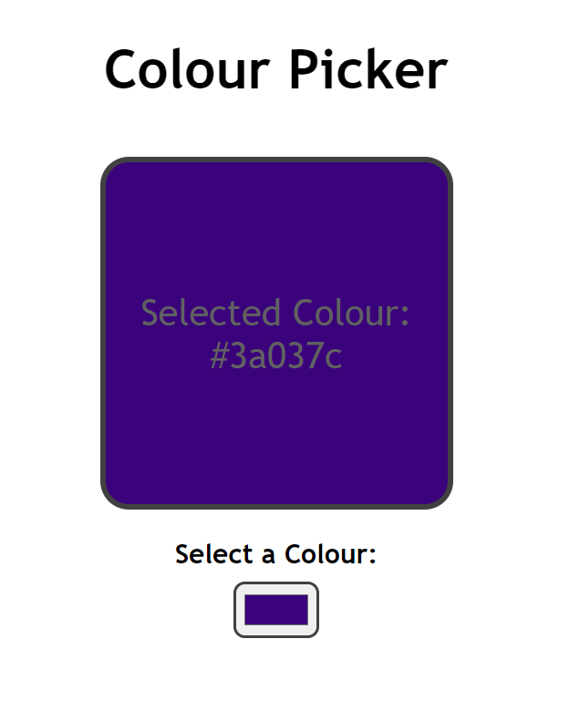
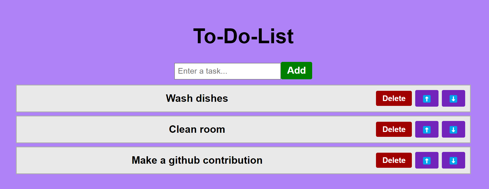

# Collection of Mini React Projects
This repo contains a few of my small projects made with React to practice and learn React.

To run the projects:  
`cd` into the project directory  
`npm install` to install dependencies (requires node)  
`npm run dev` to start the project and check `http://localhost:5173/` for your app

Previews of the different projects:  

