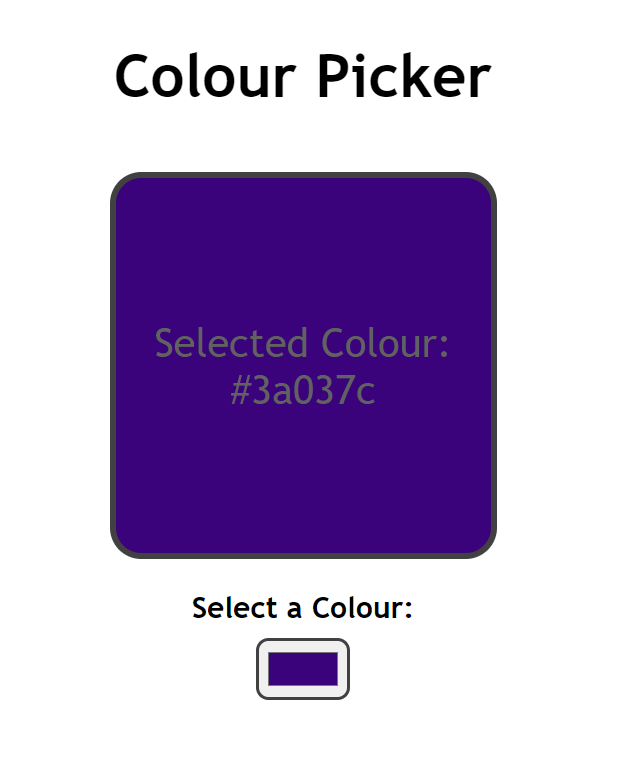

# Simple Colour Picker with React
Created a simple colour picker app using React components.  
Utilized the `useState` hook to dynamically change the colour of the display component on change of the colour input.  

Preview of the app:  
