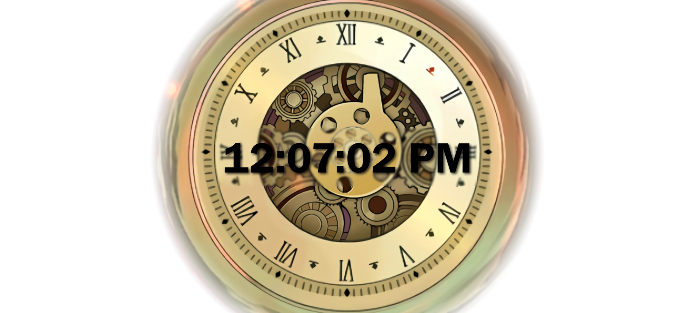

# Digital Clock in React
Simple webpage that displays the current time in the form of:  
HOURS:MINUTES:SECONDS MERIDIEM

This program utilizes the `useState` and `useEffect` hooks from React.  
The time is stored as a state variable. This gets updated within the `useEffect` upon mount of the component which occurs every second due to an interval.

Preview:  
