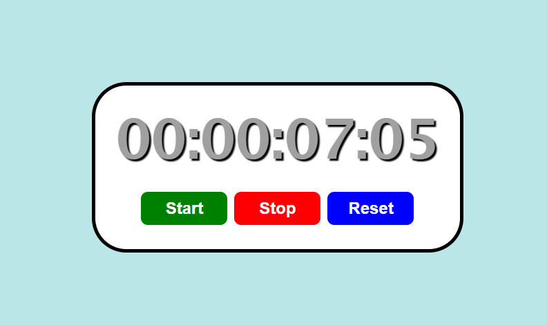

# Simple Stopwatch in React
This program creates a basic stopwatch with React.  
It utilizes various hooks such as `useState`, `useEffect`, and `useRef`.  
It's an interactive stopwatch with buttons to start, stop, and reset the time.

Preview:  
